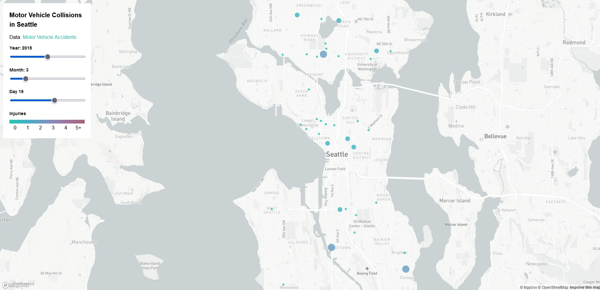

# [Geog495SeattleMotorAccidents](https://derrickn-1720724.github.io/Geog495SeattleMotorAccidents/)

## Project Description

The project is intended for individuals to see the difference in trends between months, dates, and years on motor accidents. A big factor on what we are able to do with this is able to see specific days and see how much more accidents are prone on these days. For example, New Years Eve and New Years day. With these options, we are able to see a very in-depth analysis of trends over time. My goal through this project is to allow others to be much more knowledegable on what days are more prone to accidents and to help them be much more cautious. We are able to use Mapbox and several different web services such as github to further showcase our project. 

### Data Sources

The [Data](https://data-seattlecitygis.opendata.arcgis.com/datasets/SeattleCityGIS::collisions/about) was given by the city of Seattle. When working with the data, I had to convert the dates to seperate month, year, and day variables to make them much easier to work with. The data is updated very often and allows us to see constant updates on the motor accidents in Seattle. 

### Main Functions

A very big function that allowed me to work with all this data was map.on, map.addLayer and the several different filter functions I used to use the information I wanted in the way I wanted to use them. 

#### Acknowledgements 

I would like to acknowledge the city of Seattle for providing us data on not only this but different parts of our city as well. I would also like to thank all the proffessors and TA's this quarter for teaching us on how to further work these programs and expand our knowledge. 